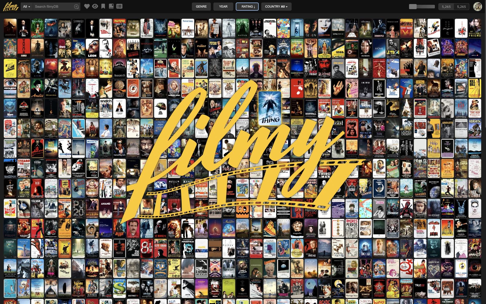

# ***filmy* \- Movie & Series Web App**

A sophisticated Progressive Web App for cataloging and exploring your personal media collection, built with pure JavaScript and zero external dependencies.

## **Overview**

*filmy* is a powerful web application that helps you organize, discover, and enjoy your movie and TV series collection. Built with vanilla JavaScript and leveraging modern browser technologies, it offers a feature-rich experience without any external dependencies.

This is a Vibe Coding experiment, building a web app from scratch without writing a single line of code.

## **Key Features**

## **Content Management**

* **Smart Media Addition** \- Easily add movies and series through intuitive TMDB/OMDB search: type a title and click the Add (+) button   
* **Custom Poster Selection** \- Personalize your collection with handpicked posters and backdrops  
* **Watchlist Import** \- Import existing IMDb movie lists into your collection  
* **Core Lists** \- Favourites, Watched/Unwatched, Watchlist, Collection  
* **Custom Lists** \- Create and manage personalized lists to organize your collection  

## **User Interface**

* **Dynamic Poster Grid** \- Browse your collection in a responsive layout with adjustable poster sizes (50-300px)  
* **Instant Information** \- Access ratings, trailers, and key details via elegant hover tooltips  
* **Advanced Filtering** \- Filter by genre, year, ratings (IMDb, TMDb, Metacritic, Rotten Tomatoes), and country, with active filter indicator (top right side) displaying filtered | total number of records based on the selected criteria    
* **Smart Search** \- Find content across multiple categories (movies, series, people, keywords)

## **Media Experience**

* **Immersive Backdrop Slideshows** \- Explore high-quality production images in the detail view  
* **Integrated Trailer Playback** \- Watch trailers without leaving the application  
* **Comprehensive Cast & Crew** \- Discover the people behind your favorite content  
* **Personal Notes** \- Add and manage your thoughts about each title

## **Technical Features**

* **IndexedDB Storage** \- Sophisticated local database with complex schema design.  
  * Browser-Specific Storage: IndexedDB data is tied to the specific browser instance. If you switch browsers, you'll need to either import your database from the previous browser using the backup/restore feature, or set up a new instance in each browser.  
* **Multiple User Profiles** \- Support for multiple user profiles within the same browser  
  * Each profile maintains its own settings, lists, and preferences  
  * Easily switch between profiles from the settings menu  
  * Great for households with multiple users sharing the same d
* **Lazy Loading** \- Efficiently handles collections of 10,000+ movies  
* **Resource Efficiency** \- Inline SVG symbol library with zero external dependencies  
* **Keyboard Navigation** \- Letter jumping and detailed keyboard shortcuts  
* **Progressive Web App** \- Install on any device
* **Responsive Design** \- Currently optimized for desktop use, with mobile optimization in progress  
  * Best experienced on tablets and larger screens
  * Mobile phone support is limited in Version 1.0 Beta

## **Screenshots**
* **Grid View (50px)** 

* **Grid View (300px)** 

* **Detail View** 

* **Setup**

* **About**

## **Installation**

1. Clone the repository  
   `git clone https://github.com/yourusername/filmy.git`  
2. You can use Filmy in two ways:  
   1. Simple method: Open index.html directly in your browser  
   2. Web server method (recommended for full PWA features):  
      1. Using Node.js: npx http-server  
      2. Using Python: python \-m http.server  
      3. Or use a VS Code extension like "Preview on Web Server"  
      4. Then open http://localhost:8080 (or the appropriate port) in your browser  
3. Obtain free API keys from [TMDB](https://www.themoviedb.org/settings/api) and [OMDb](https://www.omdbapi.com/apikey.aspx)  
4. Enter your API keys in the Settings menu

While Filmy works when opened directly as a file, using a web server enables full Progressive Web App functionality including service worker features like partial offline support and caching. The application's core IndexedDB functionality works in both scenarios.

## **Keyboard Shortcuts**

## **Grid View**
**Shortcuts work at any grid size**
* **N** \- Add a note for media card in focus  
* **D** \- Open Detail View for media card in focus  
* **T** \- Play trailer for media card in focus 
* **R** \- Refresh media card in focus

## **Detail View**

* **SPACE** \- Backdrop View / Start Slideshow  
* **Left/Right** \- Navigate through backdrops  
* **X/ESC** \- Close Popup

## **Technical Architecture**

* **Pure JavaScript** \- No frameworks, libraries, or dependencies  
* **IndexedDB** \- Complex schema for persistent local storage  
* **Multi-Level Caching** \- Runtime performance optimization with Map objects  
* **Service Worker** \- Partial offline support with caching of application resources (HTML, CSS, JS)  
* **Image Management** \- Remote image loading with local caching for improved performance  
* **Responsive Design** \- Adapts to various screen sizes with adjustable poster grid (50-300px)

## **Browser Compatibility**

Filmy works best in modern browsers that support IndexedDB, Service Workers, and ES6+ features:

* Chrome (recommended)  
* Opera  
* Firefox  
* Edge  
* Safari 14+

## **Development**

This project was developed from January to April 2025 using AI-assisted development techniques. All code in Version 1.0 was generated and debugged using natural language prompts with various LLM models (primarily Claude 3.7).

For future improvements, please check the [ROADMAP.md](ROADMAP.md) file.

## **Contributing**

Contributions are welcome\! Please feel free to submit a Pull Request.

## **License**

MIT License \- See [LICENSE](LICENSE.md) file for details.

# **Support & Acknowledgements**

## **Support the Project**

If you enjoy Filmy and want to support its continued development:

* [PayPal](https://paypal.me/AlexanderIpfelkofer)  
* [Buy me a coffee](https://ko-fi.com/alexanderipfelkofer)  
* [Patreon](https://patreon.com/AlexanderIpfelkofer)

## **Stay Updated**

* Subscribe to development updates on [Substack](https://alexanderipfelkofer.substack.com/)

## **Powered By** 

* [The Movie Database (TMDB)](https://www.themoviedb.org/)
* [Open Movie Database (OMDB)](https://www.omdbapi.com/)

*This web application uses The Movie Database (TMDB) and the OMDB API but is not endorsed, certified, or otherwise approved by TMDB or OMDB.*  
*This web application provides links to IMDb, Metacritic, and Rotten Tomatoes for reference purposes only. We are not affiliated with or endorsed by these services.*  